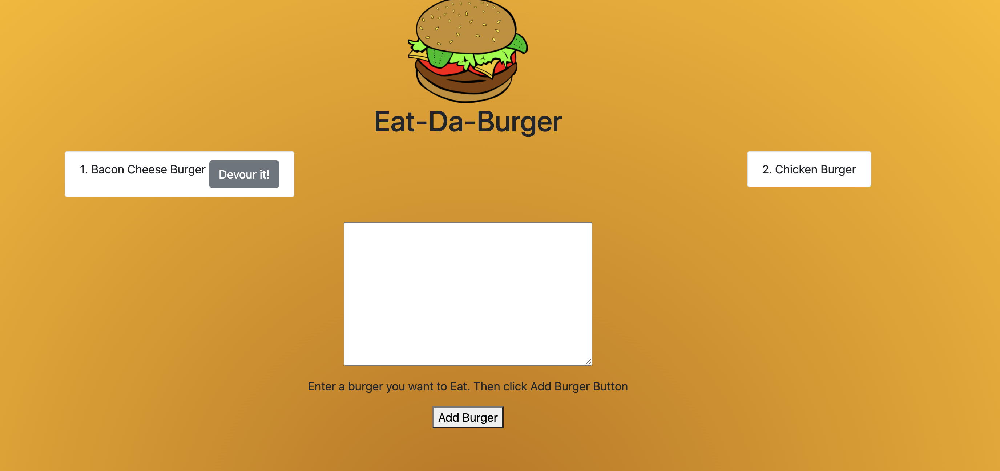

# Node_Express_Handlebars

## Description
Using MySQL, Node, Express, Handlebars and a homemade ORM I created an app that logs text into a database (DB). It is able to pass information from the user to a DB where it is stored. It can also be removed by the user with a simple click of a button. This link is deployed on Heroku and uses JAWSBD. More information can be found at my github, see below. 

A screenshot of the deployed app. 

## Current Version 

v1.0

## Table of Contents

    * Installation
    * Usage
    * License
    * Contributing
    * User GitHub profile picture
    * User GitHub email
                
## Installation

This link can be deployed at :https://powerful-taiga-64442.herokuapp.com/

## Usage

This is open to the public

## License

Public domain  

## Contributing

NA

##Questions
undefined

## Contact Information

https://github.com/truittj

